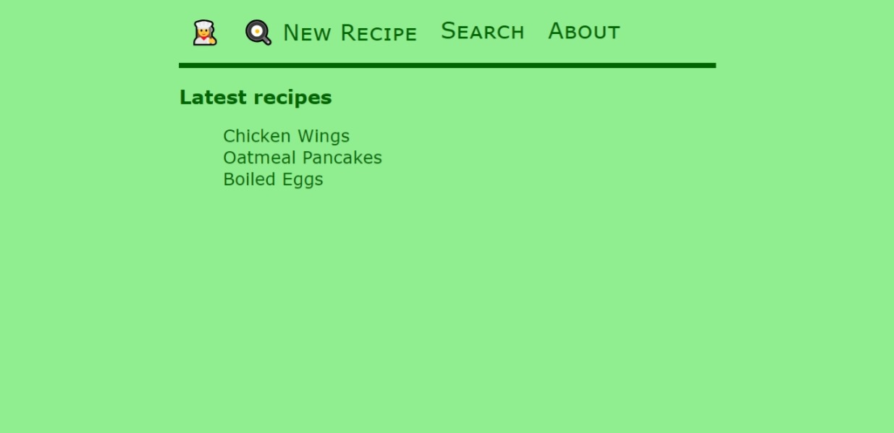
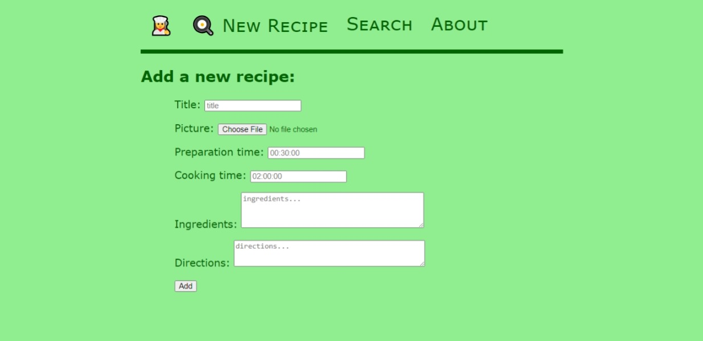
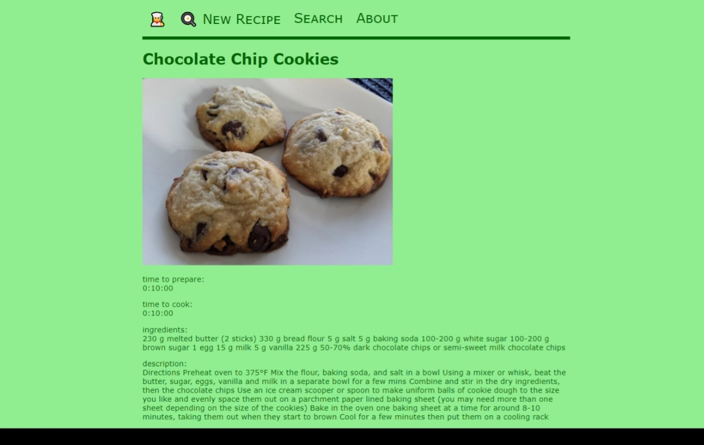

# Usage
## Clone the repository with 
    git clone recipesite

## Create a virtual environment with venv or conda
    $ python -m venv /path/to/new/virtual/environment
or

    $ conda create -n envname

## Activate the virtual environment
venv:

    $ source <venv>/bin/activate

conda:

    $ conda activate envname

## Install the dependencies
    $ pip install django, pillow
or

    $ conda install django, pillow

## Create the database
    $ python manage.py makemigrations
    $ python manage.py migrate

## Run the server
    $ python manage.py runserver

